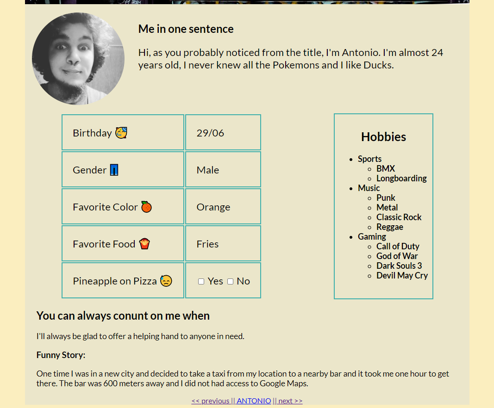

# Title: HTML introduction
# Website [LINK](https://antoniobaciu.github.io/html-introduction/)

## Learning objectives
- Explore the HTML language
- To be able to write down content using the HTML syntax
- To be able to work and communicate in a group
- To be able to deploy a page online with GitHub.
- Gain knowledge how to validate HTML code with the w3 validator.

## Mission
Let's write some HTML !

If you want some introduction you can read some introduction in [the workshop we do before the selections](https://github.com/becodeorg/Workshop-BeCode-antwerp). If you already followed this than great, you are super prepared for your new challenge!

## Instructions
- Create a repository on Github **html-introduction** and make it public
- Create an `index.html` file
- Make a page with HTML with the content described below.
- ALSO make the modifications to your readme.md file locally (on your computer) and then commit and push them online. This will teach you how to bring a page online with github. **IMPORTANT: avoid the edit functionality on the website of github.**
- Check if your HTML code is valid with [the html validator](https://validator.w3.org/)

### Must-have features

- Your name (big header)  
In italics an inspirational quote  
A photo of yourself. Keep it professional!   

- Me, in one sentence (smaller header)  

- Create a table with the following structure:

    Birthday: dd/mm  
    Gender: ?  
    Favorite color: ?  
    Favorite food: ?  
    Pinneapple on pizza: Yes/No (Extra challenge: make it look like a (un)checked checkbox)  

- Hobbies (smaller header)  
This should contain a bullet list of your hobbies.  
At least on item should contain a sublist, for example if you like movies, maybe make a sublist of some movies you really like.

- You can always count on me when (smaller header)  
Tell your teammates which positive contribution to the group you will make.  
This could be technical, making people feel comfortable, being an organiser...  

- A funny story (smaller header)   
Tell a short funny story about your life.   

- TL;DR (even smaller header, under funny story)  
Summarise your funny story in one short sentence.  

- At the bottom of the page there should be a next and previous link, this should link to the page of the previous student (alphabetically) and the next one.  
Organise yourself so it is easy to know who you should link to.  

The links should have the following structure:  

<< previous || YOUR NAME || next >>  

## Tips

- Preview your HTML by opening it with your browser.
- You can right click on any webpage you like and select "inspect" to see there HTML structure to give you inspiration.

### Some useful resources

- [w3schools](https://www.w3schools.com/html/default.asp)
- [HTML basics on MDN](https://developer.mozilla.org/en-US/docs/Learn/Getting_started_with_the_web/HTML_basics)
- [freecodecamp course](https://learn.freecodecamp.org/responsive-web-design/basic-html-and-html5)
- [html5doctor](http://html5doctor.com/)
- [CodeCademy course](https://www.codecademy.com/learn/learn-html)
- [Just google it !](google.com)

